# Project 1: Design Journey

Be clear and concise in your writing. Bullets points are encouraged.

**Everything, including images, must be visible in Markdown Preview.** If it's not visible in Markdown Preview, then we won't grade it. We won't give you partial credit either. This is your warning.

## Existing Design, Planning, & Refined Design (Milestone 1)

### Existing Site: Target Audience I (Milestone 1)
> Who is your _existing_ site's target audience?
My existing site's target audience is people that hope to discover their
sense of style.

### Existing Site: Target Audience I Needs (Milestone 1)
> Document your existing site's target audience's needs.
> List each need below. There is no specific number of needs required for this, but you need enough to do the job.

- Need #1: Gaining inspiration from clothing
  - **Need**
    - > What does your existing target audience need?
    * A way to find new clothes
  - **Design Choices**
    - > How does your existing site meet this need?
    * A page with photos of different clothes of various styles that can
    inspire the user's own fashion sense.
    *The photos of clothing are arranged in a table so they are easy to look
    at and organized instead of overwhelming.
- Need #2: Gaining inspiration from photography
  - **Need**
    - > What does your existing target audience need?
    * A way to discover their aesthetic
      - **Design Choices**
    - > How does your existing site meet this need?
    * A page with "style inspiration", which includes photos with different
    aesthetically pleasing components.
    * This can help the user understand
    which type of look or aura that appeals to them.
    * They can apply this
    information to clothing by choosing clothes that look similar to photography
    they like.
    * The photos with different types of "aesthetics" are arranged in a table
    to be easy on the eye and organized.
    * A black border adds contrast to the photos and accentuates its colors
    and details.
  -
- Need #3: Understanding the Website
  - **Need**
    - > What does your existing target audience need?
    * Help navigating the website and understanding what its purpose is
      - **Design Choices**
    - > How does your existing site meet this need?
    * A navigation bar with clear titles of each page
    * A header on each page with the title of the page so the user knows
    where her or she is on the site.
    * An about page that explains the purpose of the website
  - Need #4: Finding New Style based on current style
  - **Need**
    - > What does your existing target audience need?
    * A way to learn what their style is based on their current fashion
    choices.
      - **Design Choices**
    - > How does your existing site meet this need?
    * A quiz that determines the user's style based on their fashion icon,
    favorite color and preferences when it comes to clothes.


### Existing Site: Design/Sketches (Milestone 1)
> Sketch your existing site. Include these sketches here.
> DO NOT COPY SKETCHES FROM THE ORIGINAL ASSIGNMENT! Create new sketches here. This is part of the design process to get you thinking about the strengths/weaknesses of the current design.
> Provide a brief explanation _underneath_ each sketch.

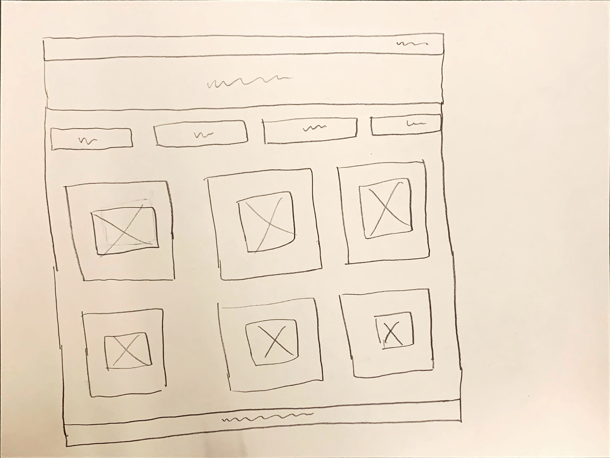
* The header has the title of the web page in order to give the user a sense
  of what the website is about and where they are located within the website.
* The navigation bar is on every page so the user knows what else is on the
  website and gives them a way of clicking between pages easily.
* The images of clothing are arranged in a neat grid to make them easy to look
  through and not overwhelming.
* The footer at the bottom of the page gives credit to the web developer.

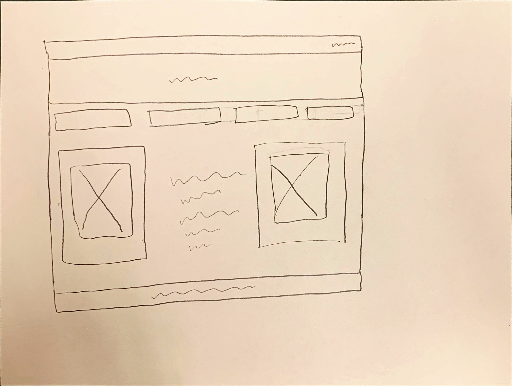
* The about page includes the navigation bar and a header which lets the user
  know where they are within the website and gives them a means of getting to
  other pages.
* The text describing what the website is about is centered to show that it is
  main component of the web page. The text is also padded so the page does not
  look crowded.
* The image on the left and right shows models looking confident in their
  clothing, which gives the user a sense of the confidence someone can have
  if they express themselves through fashion.
* The footer at the bottom of the page gives credit to the web developer.

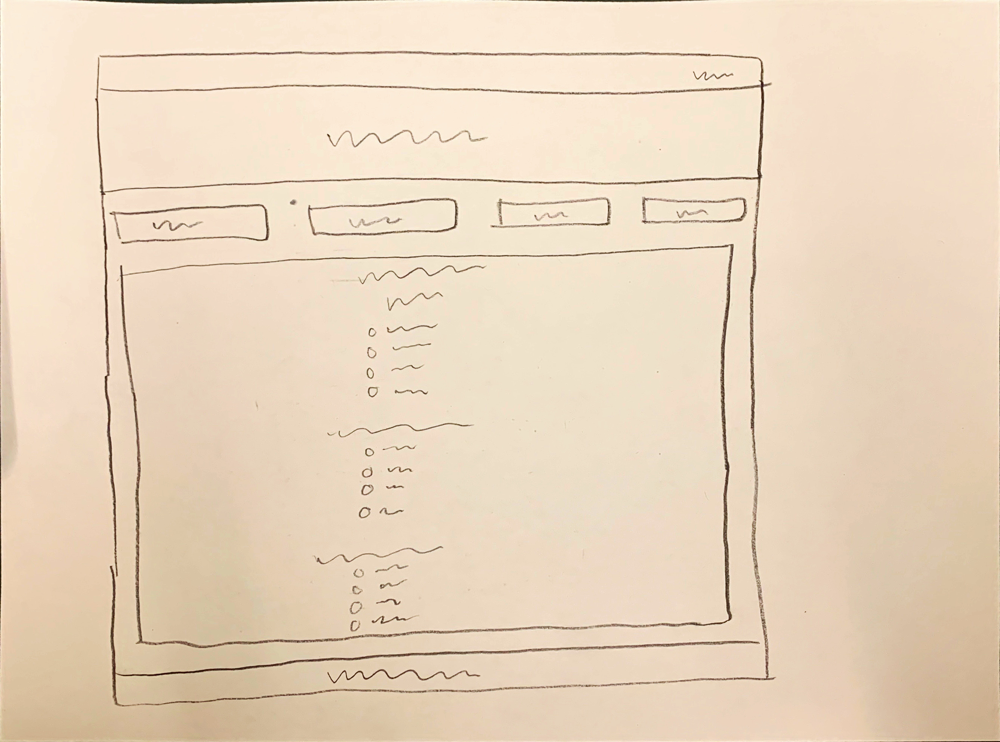
* The header and navigation bar tells the user where they are on the website
  and gives them a way of getting to other web pages.
* The quiz is centered on the page so the user's focus is drawn to it.
* There are line spaces between each question in the quiz so the page does not
  look crowded.
* The questions are in a different font from the answer options to help the
  user discern the questions from the answers.
* The footer at the bottom of the page gives credit to the web developer.

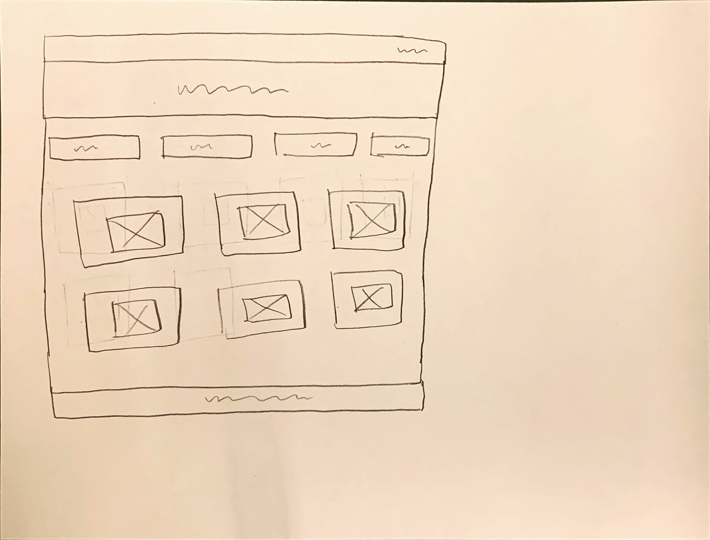
* The navigation bar and header show the user where they are on the website,
  where they can go, and gives them a way of getting to other pages.
* The images are arranged into a grid so the user is not overwhelmed by
  so many images. Because of the organization of the photos, the page still
  looks neat and presentable.
* The images show different types of aesthetics that the user could use for
  inspiration on how to dress.
* The footer at the bottom of the page gives credit to the web developer.


### Refined Site: Target Audience II (Milestone 1)
> Who is your additional/secondary target audience?
  My secondary target audience is people looking for affordable clothing.

### Refined Site: Target Audience II Needs (Milestone 1)
> Document target audience II's needs.
> List each need below. There is no specific number of needs required for this, but you need enough to do the job.

- Need #1: Finding affordable clothing
  - **Need**
    - > What does your target audience II need?
    * This target audience needs a way to find clothing that is not only
    stylish, but within their budget.
  - **Design Ideas and Choices**
    - > How will you refine your site's design to meet this need?
    * A page that only includes clothing within a certain price range from
      brands that are affordable for most people.
- Need #2: Finding their budget
  -   - **Need**
    - > What does your target audience II need?
    * This audience needs to find what their budget is in order to reinvent
    their style.
  - **Design Ideas and Choices**
    - > How will you refine your site's design to meet this need?
    * A form that helps the user determine their price range for clothing.

- Need #3: Navigating the website
  -   - **Need**
    - > What does your target audience II need?
    * This audience needs pages pertaining to affordability to be linked in
    the navigation bar.
    * These pages should also have a header and be described in the about page.
  - **Design Ideas and Choices**
    - > How will you refine your site's design to meet this need?
    * An updated navigation bar, about page, and updated header titles for each
    web page.


### Refined Site: Content Organization/Navigation (Milestone 1)
> Identify the content that is necessary for both target audiences.
> List the content here.
> Don't forget to include the form.


- Form to help user determine what their price range should be, what they can
  afford to spend each month
- A list of affordable styles and companies
- A page of photos of clothing from affordable companies that are only for
  people on a budget.
- An updated navigation bar with these new pages with updated header titles
- An updated about page that describes how the website caters to people on a
  budget


> Organize the content for the target audience and identify possible pages for the content using card sorting.
> First, organize the content for target audience I. Document your card sorting by taking a photo and including it here.
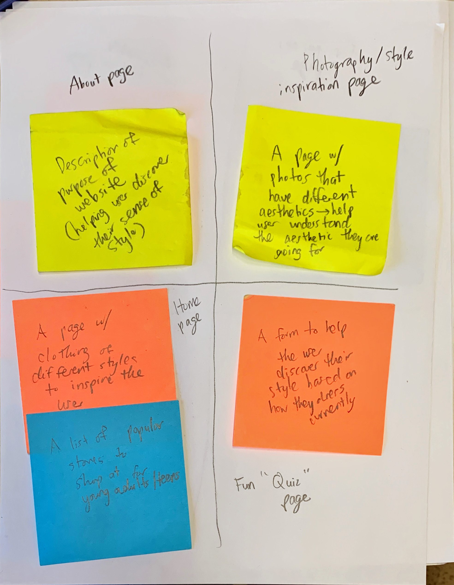

> Second, organize the content for target audience II. Document your card sorting by taking a photo and including it here.
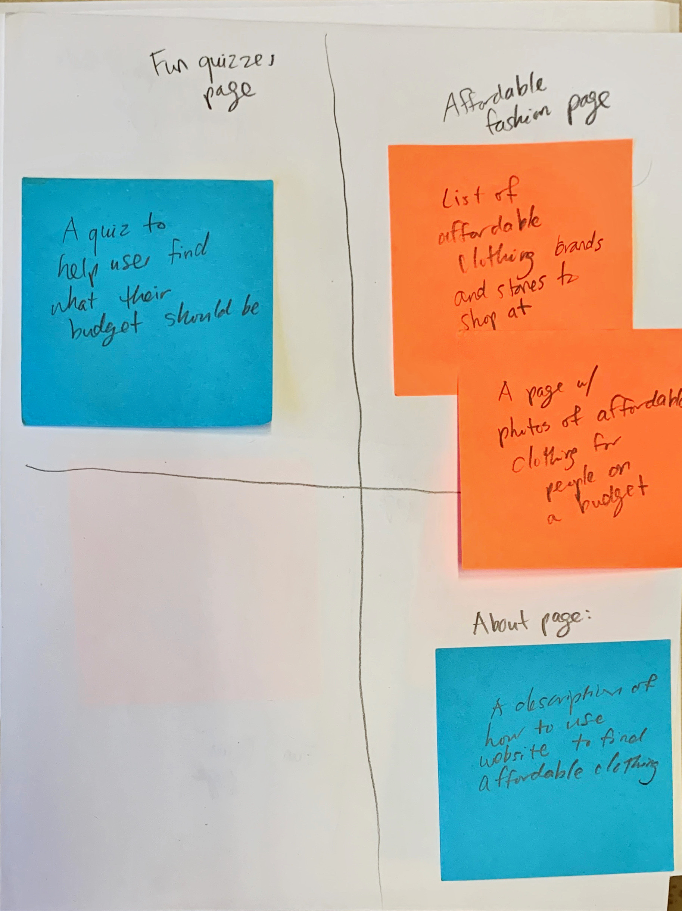

> Next, organize the content for both target audiences. Document your card sorting by taking a photo and including it here.
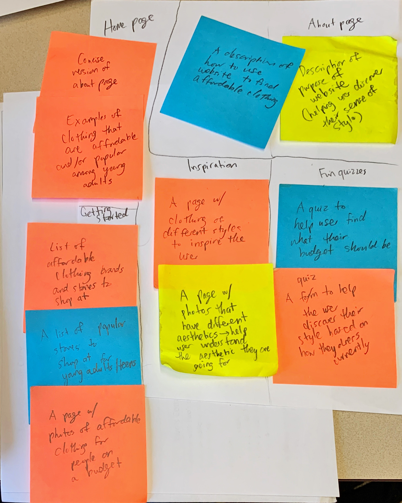

> Lastly, list the pages that resulted from your final card sort (i.e. your site's navigation).

- Home
- Getting Started
- Inspiration
- Fun Quizzes
- About

### Refined Site: Design (Milestone 1)
> Refine the design of your site to meet the needs of _both_ target audiences.
> Include sketches of each page of the refined design.
> Provide a brief explanation _underneath_ each sketch.
> Document your _entire_ design process. **Show your preliminary sketches and your final sketches.**
> Don't forget the form and confirmation page!
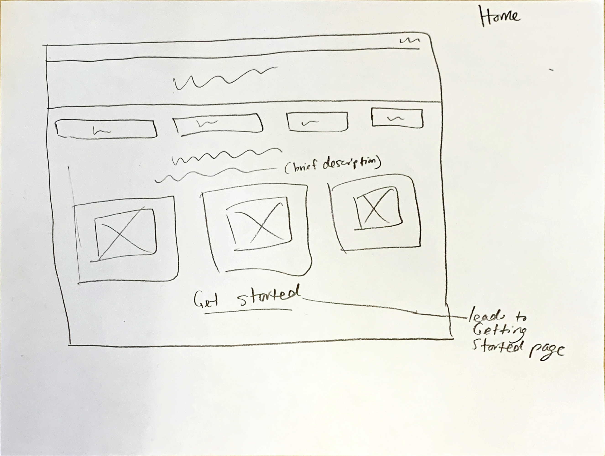
Home page includes brief description of website and photos of stylish and
affordable clothing.

About page describes purpose of website.
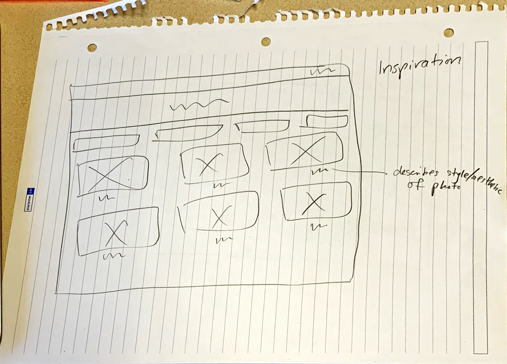
Inspiration page includes photos of different types of styles of clothing
and aesthetics.
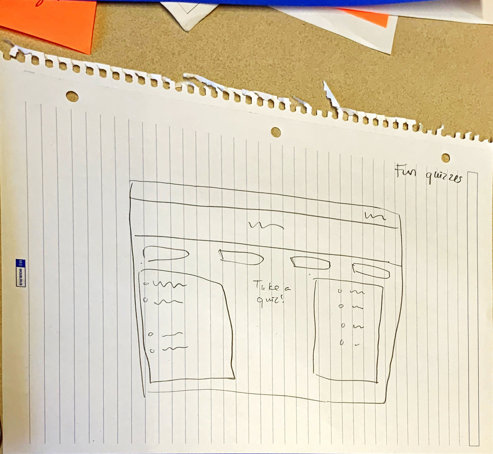
Quizzes page includes quiz to discover your style and a quiz to determine
your price range a.k.a the store you should shop at.
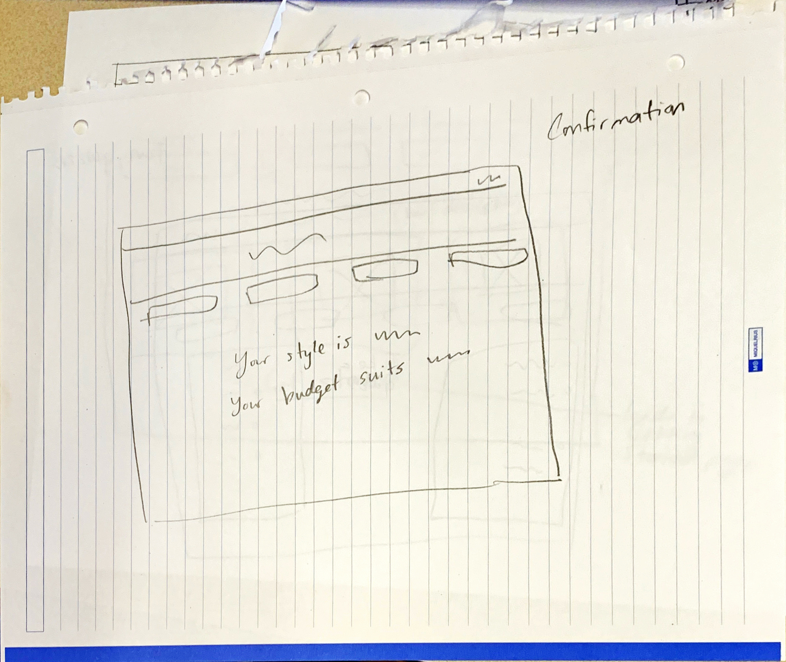
Confirmation page says what your style is and what your budget is depending
on the quiz you took.
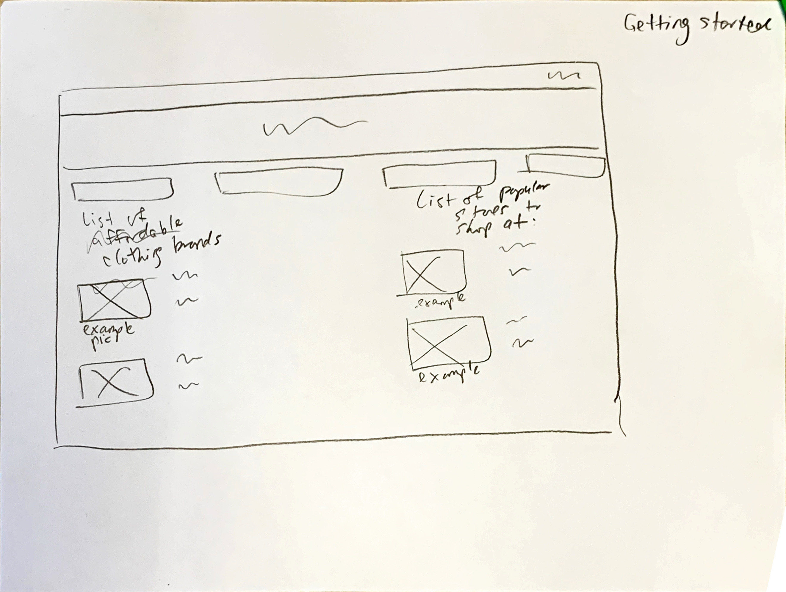
Getting started includes lists of affordable and stylish/popular clothing brands
in addition to example photos of these brands. Also includes links and description
of how to use the website.
### Partial Plan (Milestone 1)
> Using your refined sketches, plan your site's partials.
> You may describe each partial or sketch it. It's up to you!

*The partials will include the navigation bar, header and footer. The title in the
header of of each page
will change based on which page the user is currently on.
The navigation bar will be the same on each page.
Lastly, the footer will be the same for
every page.

---

## Sticky Form Planning (Milestone 2)

### Sticky Form (Milestone 2)
> What controls do you need for your form?
I plan on having a control asking the user what they look for in clothing to see
what values users have when shopping, whether it be affordability, style, comfort, or convenience.
I also ask about where the user is planning on finding clothes in the future to see if they will take the advice described on the website. I also ask if they have a better sense of their style after visiting the website. Lastly, I ask for any additional feedback from the visitor.

> Plan out your feedback messages for your form. You may sketch (probably the easiest) or write it out.
I will thank the user for providing feedback. Then, I will echo their responses to each of the questions as well as the questions themselves so the users remember what the form said. This way, they can be sure that their responses were received.


> How does this form meet the needs of at least one of your target audiences (specify which)?
These elements of the form ask for input from both people who are on a budget and people who are only concerned about fashion. Through this form, I can see how well I addressed both of these audiences' needs and how to improve my website to cater to them. I can also see, based on the users' values, which stores they decided to shop at. If their values match with the stores I recommended for their needs (on the Getting Started page), then I know they took my advice and was useful to them.

### Validation Code Plan (Milestone 2)
> Write out your pseudocode plan for handling the validation of the form.

```
show_first_error_message = FALSE
show_second_error_message = FALSE

show_form = TRUE

is_valid = TRUE

if POST request sent {
  get value of post request from each input
  check if value of each request is empty:
    if empty, then show feedback above that specific input. Also, set is_valid to FALSE.

set show_form to the opposite of is_valid

}
```

---

## Complete & Polished Website (Final Submission)

### Target Audiences (Final Submission)
> Tell us how your final site meets the needs of the target audiences. Be specific here. Tell us how you tailored your design, content, etc. to make your website usable by both target audiences.
My final site meets the needs of both people on a budget and people whose only concern is finding fashionable and trendy clothing. I did this by creating a "Getting Started" page that has a list of ways to find clothing that is of good value, and a list of stores that have the trendiest clothing with the most variety. In my descriptions, I explained the pros and cons of each platform or store that I recommended, making sure to think from the target audience member's perspective. I also provided a list of links to websites and apps that I mentioned such as Poshmark and DePop. I decided to provide links for these websites because they are lesser known than brands like Brandy Melville and Urban Outfitters. I also centered the links and used bold colors to draw the reader's attention to the links. The content I wrote was all in black lettering against a white background to make it easy to read. Through the getting started button on the home page, I made it easy for users to find this useful content. The about page also thoroughly describes the purpose of the website and how to get the most out of it. This makes the website easy to use for anyone. Lastly, the inspiration page I provided appeals to both target audiences because it simply shows inspiration for styles they might want to buy. Therefore, the visitor can use this inspiration when buying any clothing, whether it be affordable or high-end.

### Additional Design Justifications (Final Submission)
> If you feel like you haven’t fully explained your design choices in the final submission, or you want to explain some functions in your site (e.g., if you feel like you make a special design choice which might not meet the final requirement), you can use the additional design justifications to justify your design choices. Remember, this is place for you to justify your design choices which you haven’t covered in the design journey. You don’t need to fill out this section if you think all design choices have been well explained in the design journey.
N/A

### Self-Reflection (Final Submission)
> Reflect on what you learned during this assignment. How have you improved from 1300? What things did you have trouble with?
I didn't take 1300 but I had previous web development experience before starting this assignment. Through this assignment, I learned a lot about making design choices that make the website user-friendly and meet the needs of different audiences. I was able to consider the audiences that most likely would use my website and designed my website accordingly. When creating this website, I learned to not make design choices purely for aesthetics, but also with a purpose.
